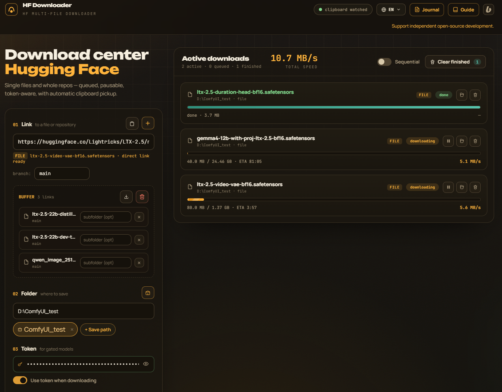

# HF Downloader

> Offline desktop app to grab models, datasets and spaces from [Hugging Face](https://huggingface.org) with pause, resume and clipboard pickup. Runs entirely on your machine — no cloud, no telemetry.

[](LICENSE)
[](https://www.python.org/downloads/)
[](#download)
[](locales/)

<p align="center">
  
</p>

## What it does

- **Download** any model, dataset or space — single files or whole repos
- **Pause & resume** downloads (HTTP Range headers + `.part` files, survives crashes)
- **Queue** with optional strict one-at-a-time mode
- **Bookmarks** for repos you grab often
- **Clipboard watch** — paste a HF link anywhere, the app picks it up
- **Token support** for gated models (sent directly to huggingface.co, never logged)
- **12 languages** in the UI: English, 中文, हिन्दी, Español, Français, العربية, বাংলা, Português, Русский, اردو, Deutsch, 日本語

All traffic is local (`127.0.0.1`). The app does not phone home, except a single check for new releases on startup (you can disable it — see [Configuration](#configuration)).

---

## Download

Head to the **[Releases](../../releases)** page and grab the archive for your OS:

| OS | File | What to do |
|---|---|---|
| 🪟 **Windows** | `HF-Downloader-windows.zip` | Unzip, double-click `HF-Downloader\HF-Downloader.exe` |
| 🍎 **macOS** | `HF-Downloader-macos.zip` | Unzip, open `HF-Downloader.app` (right-click → Open the first time, Gatekeeper will warn) |
| 🐧 **Linux** | `HF-Downloader-linux.zip` | Unzip, run `./HF-Downloader/HF-Downloader` |

> First run on Windows might trigger SmartScreen ("unknown publisher"). Click **More info** → **Run anyway**. This is normal for unsigned open-source apps; we don't have a code-signing certificate yet.

If you prefer running from source (developers, contributors) — see [Building from source](#building-from-source).

---

## Features in detail

### Downloads
- **Whole repos**: paste `huggingface.co/owner/repo` → gets everything
- **Single files**: paste `huggingface.co/owner/repo/blob/main/file.bin` → gets that file
- **Resume**: every byte is tracked, kill the app mid-download and pick up where you left off
- **Retry with backoff**: configurable, handles flaky networks
- **Speed limit**: cap your bandwidth so the app doesn't kill your video call
- **Sequential mode**: process one task at a time instead of all in parallel

### UI
- Two panels: form on the left, live download cards on the right
- Status pills: `queued`, `downloading`, `paused`, `done`, `error`
- Per-task actions: pause, resume, cancel, retry, open in folder
- **Journal** (📋 button) — live log of warnings and errors with filter and copy-to-clipboard
- **Bookmarks** (⭐ under the folder field) — save and re-download repos with one click
- **Clipboard watch** — toggle in the top bar; respects your OS permission prompt
- **Language switch** — top-right dropdown, 12 languages, choice persists across restarts

### Privacy
- **No telemetry**, no analytics, no crash reports
- **No network calls except**:
  - Downloads to `huggingface.co` (and Hugging Face CDN)
  - One optional `api.github.com` check at startup for updates (silent failure if no internet)
- **Token** stays in your browser's localStorage; never persisted to disk unless you save it explicitly
- **Logs** mask tokens, Authorization headers and repository names automatically

See [SECURITY.md](SECURITY.md) for the full security model and how to report vulnerabilities.

---

## Building from source

You need **Python 3.9 or newer**. That's it.

```bash
# Clone
git clone https://github.com/alexveliyar-coder/HF-Downloader.git
cd HF-Downloader

# Install dependencies
python -m pip install -r requirements.txt

# Run
python main.py
```

On **Windows** there's also a one-click launcher:
```cmd
start_windows.bat
```

On **macOS / Linux**:
```bash
./start_mac_linux.sh
```

Both launchers auto-install missing dependencies on first run.

### Building a standalone .exe / .app

If you want to package it yourself (e.g. for distribution):

```bash
pip install pyinstaller
pyinstaller --noconfirm --clean hfdownloader.spec
# Result: dist/HF-Downloader/  (onedir mode, fast startup)
```

To produce a single-file binary:
```bash
HF_APP_MODE=onefile pyinstaller --noconfirm --clean hfdownloader.spec
```

Or just push a `vX.Y.Z` tag — GitHub Actions will do it for all three platforms automatically. See [.github/workflows/release.yml](.github/workflows/release.yml).

---

## Configuration

Most things work out of the box. Optional tweaks:

| What | Where | Default |
|---|---|---|
| Web UI port | `WEB_PORT` in `main.py` | 8777 (auto-picks next free if busy) |
| Core server port | `PORT` in `src/hf_core_server.py` | 8765 |
| Update-check repo | env `HF_DOWNLOADER_UPDATE_REPO` | this repo |
| Disable update check | env `HF_DOWNLOADER_NO_UPDATE=1` | off |

User preferences (bookmarks, last folder, language) are stored in plain-text files next to `main.py`:
- `.lang.txt` — selected language
- `.last_dir.txt` — last folder used
- `.tasks.json` — active task state (so you can kill the app and resume)
- `hfdl_bookmarks.json` — your bookmarks
- `.hfdl_log.txt` — rolling log, last 500 lines

All are listed in [`.gitignore`](.gitignore) — they stay on your machine.

---

## Project structure

Top-level layout — only the files a casual user needs to know about are in the root. Everything else is tucked into a subfolder.

```
.
├── main.py                  # entry point: run this
├── start_windows.bat        # double-click on Windows
├── start_mac_linux.sh       # double-click on macOS / Linux
├── requirements.txt         # Python deps (requests, pywebview)
├── LICENSE                  # AGPLv3
├── README.md                # you are here
│
├── src/                     # Python source
│   ├── hf_core_server.py    # download engine
│   ├── locale_loader.py     # i18n
│   ├── updater.py           # update checker
│   └── logger.py            # rolling log
│
├── site/
│   └── index.html           # entire web UI in one file
│
├── locales/                 # 12 .json translation files
│
├── docs/                    # screenshots + commercial license + repo setup notes
│
├── tests/                   # smoke checks (python -m tests.test_smoke)
│
├── .github/                 # CI, issue templates, PR template, Dependabot
│
├── pyproject.toml           # project metadata
├── hfdownloader.spec        # PyInstaller spec
└── CHANGELOG.md             # release notes
```

Other top-level files: `CONTRIBUTING.md`, `SECURITY.md`, `CODE_OF_CONDUCT.md`, `NOTICE`, `.env.example`, `.gitignore`.

---

## Known limitations

Things the app does **well**:

- Single files, whole repos, gated repos with token
- Pause / resume / retry on flaky networks
- Sequential or parallel queue with per-task speed limit
- 12 UI languages, full i18n
- Runs entirely on `127.0.0.1` — no external services

Things the app does **not** do (yet — see [Roadmap](#roadmap)):

- **No multi-file picker inside a repo.** You either grab the whole repo or a single file by URL. Partial selection ("just these 3 .bin files") is on the roadmap.
- **No proxy / mirror support.** Downloads go directly to `huggingface.co` and its CDN. If your network blocks HF, this won't tunnel through.
- **No bundled `git-lfs` fallback.** If a repo uses Git LFS for binary storage, the API returns the LFS pointer URL and we follow it normally — same as `huggingface-cli`. No extra tooling needed.
- **No magnet / BitTorrent / direct-from-S3.** Hugging Face only. Other model hosts (CivitAI, ModelScope) are not on the roadmap.
- **No code signing certificate.** Windows SmartScreen and macOS Gatekeeper will warn on first launch. See [FAQ](#faq) for how to bypass.
- **No auto-update installer.** The app notifies you when a new release is out, but you download and install it yourself. Auto-install is on the roadmap.

---

## FAQ

**Q: Windows SmartScreen blocks the .exe — "Unknown publisher". Is this safe?**
A: Yes. The warning appears because the project is not signed with a code-signing certificate (those cost ~$200/year). To launch: click **More info** → **Run anyway**. The source is right here in this repo, you can read every line.

**Q: My model is gated. Where do I put the token?**
A: Top of the main window, in the "Token" field. It's stored in your browser's `localStorage` (when running via `pywebview`) and never written to disk unless you save it explicitly. It's sent **only** to `huggingface.co` over HTTPS.

**Q: Can I download to an external drive or a folder with spaces?**
A: Yes. Use an absolute path in the Folder field, e.g. `D:\models\` or `/Volumes/external/hf/`. The app auto-resolves the path on blur and shows the resolved location under the input.

**Q: Why is the download slower than my internet speed?**
A: Either (a) Hugging Face's CDN is throttling you for that particular file — try later, or (b) you set a speed limit in the queue settings. The cap is applied per download stream, so if you have three tasks in parallel and a 5 MB/s limit, total throughput is up to ~15 MB/s.

**Q: How do I update to a newer version?**
A: When a new release is out, the app shows a notification at the top of the window with a link to the Releases page. Download the new archive, replace the old folder, done. Auto-install is on the roadmap.

**Q: Does it work offline?**
A: After the first download of a model, the file lives on your disk — the app can open it for you (📁 button next to "done" tasks). For *new* downloads you obviously need internet. The optional update check at startup fails silently when offline.

**Q: I'm on Linux and `pywebview` complains about GTK. What now?**
A: `pywebview` uses GTK on Linux. Install the system packages: `sudo apt install python3-gi gir1.2-gtk-3.0 libwebkit2gtk-4.1-dev` (Debian/Ubuntu) or the equivalent for your distro. Or just run from a regular browser — the app starts a local server on `127.0.0.1:8777` and prints the URL if `pywebview` fails.

**Q: Will you accept my pull request?**
A: Probably small fixes and translations, yes. Big features — please open an issue first to discuss. See [CONTRIBUTING.md](CONTRIBUTING.md).

---

## Contributing

PRs welcome! Start with [CONTRIBUTING.md](CONTRIBUTING.md) for the workflow, and check [open issues](../../issues?q=is%3Aopen) for things tagged `good first issue` if you want something small.

Quick taste:
- **Translating** — `locales/*.json`. Use the [translation issue template](.github/ISSUE_TEMPLATE/translation.yml).
- **Fixing a bug** — open an issue first, then send a PR. Include reproduction steps.
- **Adding a feature** — open an issue with the `feature` template. Big features should be discussed before code.

---

## Roadmap

Things I'd like to add when there's time:

- [ ] Multi-file selection before download (pick a subset of repo files)
- [ ] Built-in update installer (currently only notifies, doesn't auto-install)
- [ ] Code signing certificate (kills the SmartScreen warning on Windows)
- [ ] macOS notarization (kills the Gatekeeper warning)
- [ ] Linux packages: `.deb` and AppImage
- [ ] More languages (welcome PRs — translation is the easiest way in)

See the [open issues](../../issues?q=is%3Aopen) for the full list.

---

## License

HF Downloader is **free, open-source software** licensed under the [GNU Affero General Public License v3.0 or later](https://www.gnu.org/licenses/agpl-3.0.html) ([LICENSE](LICENSE) | [SPDX](https://spdx.org/licenses/AGPL-3.0-or-later.html)).

**In plain English:**

- ✅ **Use it** for personal, educational, or commercial purposes — for free.
- ✅ **Study it**, modify it, fork it, share your modifications — for free.
- ✅ **Run it on your computer** to download models, datasets, and spaces from Hugging Face — for free.
- ✅ **Distribute the original, unmodified** binaries (for example, as part of a Linux distro) — as long as you pass the source code and license along.
- ❌ **Fork and close the source** — not without a separate commercial license.
- ❌ **Embed in a proprietary product** without open-sourcing the combined work — not without a commercial license.
- ❌ **Run a hosted service based on a modified version** without giving your users the source — not without a commercial license.

**If you want to do any of the ❌-marked things** — for example, you're building a commercial product and the AGPLv3 obligations don't work for you — see [COMMERCIAL_LICENSE.md](docs/COMMERCIAL_LICENSE.md) and reach out. The maintainer is happy to negotiate. Pricing is based on what you need.

**If you just want to download models on your own computer** — the AGPLv3 doesn't require anything from you. Download, use, enjoy.

### Trademarks

- **"HF Downloader"** is the name under which the maintainer distributes this software. If you fork the project and distribute it under terms other than AGPLv3 or a granted commercial license, please use a different name.
- **"Hugging Face"** and the Hugging Face logo are trademarks of Hugging Face, Inc. This project is an unofficial community tool and is not affiliated with, endorsed by, or sponsored by Hugging Face, Inc.

### Bundled third-party software

- `requests` — Apache 2.0
- `pywebview` — BSD 3-Clause
- `urllib3` — MIT

See [NOTICE](NOTICE) for full attributions.

---

## Credits

Built by Alexey and contributors. Mom's doing better. ❤️

If this saved you time and you want to say thanks — there's a **Sponsor** button up top, or you can drop into my [Boosty](https://boosty.to/veliyar_ensophia) directly. Every bit helps cover my mom's rehab costs and keeps the project going.
